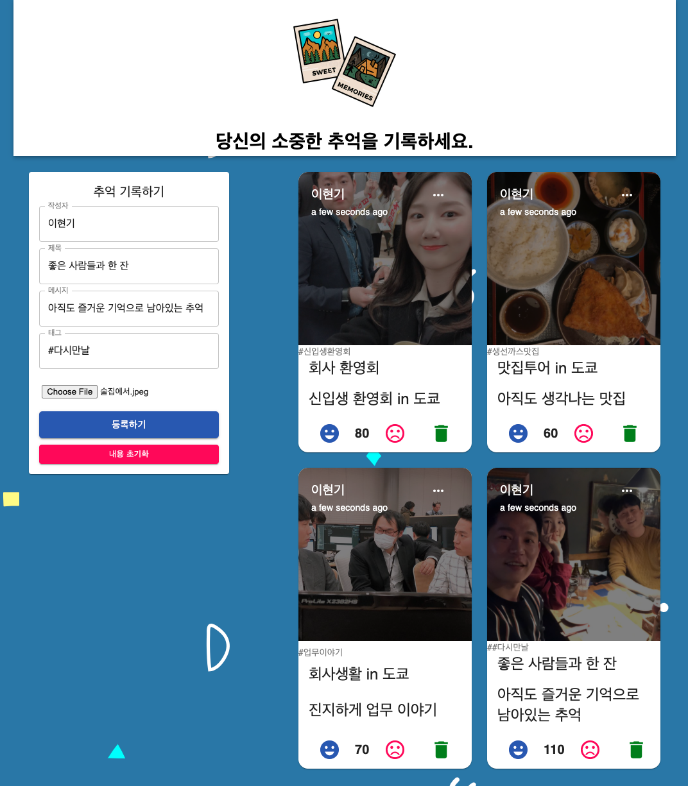

<link rel="stylesheet" href="./style.css"/>

## \<SIDE PROJECT>

# Good memories app

  

# **Objectives**

- Front-End와 Back-End 모두 테스트 주도 개발(TDD) 방식으로 개발을 진행합니다.
- MERN(MongoDB, ExpressJS, ReactJS, NodeJS)의 구성으로 프로젝트를 만들어보며 기존에 학습했던 내용을 복습합니다.
- 기존에 JavaScript로 작성한 어플리케이션을 TypeScript를 적용해봅니다.

# **The stack**

- ## Front-End
  HTML, CSS, JavaScript, React(+ Redux)
- ## Back-End
  NodeJS, ExpressJS
- ## Database
  MongoDB
- ## Test
  Jest, RTL(React Testing Library)
- ## Branch management
  Git flow model로 branch 관리

# **Project Reflection**

<b>Q1.&nbsp;이 프로젝트를 하게 된 배경은 무엇인가?</b>  

→

<b>Q2.&nbsp;무엇을 만들기 위한 목적으로 개발되었나요?</b>  

→

<b>Q3.&nbsp;이 프로젝트를 통해서 얻고자 하는 것과 개발경험에 있어, 어떤 부분이 도움이 되었는가?</b>  

→

<b>Q4.&nbsp;프로젝트 진행중에 예상치 못했던 어려움이 있었나?</b>  

→

# **Project Status**

🗓️ 2021.05.09(Sun)

**(1) Issue1) Initial setup for project**

→ [https://github.com/LeeHyungi0622/good-memories/issues/1](https://github.com/LeeHyungi0622/good-memories/issues/1)

**(2) Issue4) Server side - Post를 추가하기 위한 route, controller, model 구성하기**

→ [https://github.com/LeeHyungi0622/good-memories/issues/4](https://github.com/LeeHyungi0622/good-memories/issues/4)

🗓️ 2021.05.14(Fri)

**(3) Issue7) Client 기본 프레임 만들기**

→ [https://github.com/LeeHyungi0622/good-memories/issues/7](https://github.com/LeeHyungi0622/good-memories/issues/7)

🗓️ 2021.05.18(Tue)

**(4) Issue9) 메인 페이지 스타일링하기**

→ [https://github.com/LeeHyungi0622/good-memories/issues/9](https://github.com/LeeHyungi0622/good-memories/issues/9)

**(5) Issue11) Form 컴포넌트 만들기**

→ [https://github.com/LeeHyungi0622/good-memories/issues/11](https://github.com/LeeHyungi0622/good-memories/issues/11)

**(6) Issue13) 기존 redux 수정 및 새로운 Post 추가를 위한 기능 추가**

→ [https://github.com/LeeHyungi0622/good-memories/issues/13](https://github.com/LeeHyungi0622/good-memories/issues/13)

🗓️ 2021.05.19(Wed)

**(4) Issue15) Post 컴포넌트 만들기**

→ [https://github.com/LeeHyungi0622/good-memories/issues/15](https://github.com/LeeHyungi0622/good-memories/issues/15)

# **Project Screen Shots**

**메인 페이지**

  

# **Installation and Setup Instruction**
